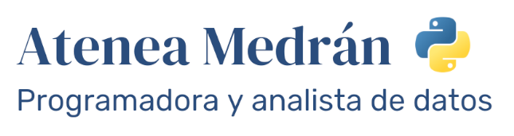

  

  

## Contact
- 👋 Hi, I’m Atenea
- 📫 You can email me at **ateneamedran@protonmail.com**
- :telephone_receiver: You can call me at +34 637 486 265
- :link: **[LinkedIn](https://www.linkedin.com/in/ateneamedran/)**

## My curriculum
- **[:page_facing_up: Español: Curriculum](https://atenea-medran.github.io/curriculum_atenea_medran.pdf)**
- **[:page_facing_up: English: Resume](https://atenea-medran.github.io/resume_atenea_medran.pdf)**

## Projects
- **[:open_file_folder: Portfolio](https://github.com/atenea-medran/atenea-medran/tree/main/Portfolio)**
- **[:bird: Project: How to analyze Twitter](https://github.com/atenea-medran/how-to-analyze-twitter)**

## Certificates
- **[🐍 Dataquest - Data Analyst - Python](Certificates/dataquest/Data%20Analyst)**
- **[🐍 Dataquest - Machine Learning - Python](Certificates/dataquest/Machine%20Learning)**
- **[💸 Dataquest - Tableau](Certificates/dataquest/Tableau)**
- **[✈️ Andalucia Vuela](Certificates/andalucia%20vuela)**

## Learnings of these months coding:
- Program small functioning pieces to avoid errors.
- Comments are here to help our future self and our colleages understand our code.
- Write everything in english from the beginning and all the dataframe columns with underscore.
- Lowercase and no accents are key to standarize data, specially in other languages.
- Prepare an scheme before coding. A piece of paper can be a good option.
- Debug is key to find the errors of your code.
- Be sure of what you have, what the function is asking and what it is giving back. The understanding of the different data types is fundamental.
<!---
atenea-medran/atenea-medran is a ✨ special ✨ repository because its `README.md` (this file) appears on your GitHub profile.
You can click the Preview link to take a look at your changes.
--->
